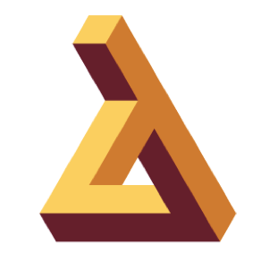

!SLIDE bullets
.notes first slide

# 2013 Language Shootout

!SLIDE bullets  transition=scrollUp

* 12 Participants (Lua, Ruby, Clojure, Racket, Java, Roy, Scala, Erlang)
* Sponsored by Rackspace
* Google Hangout
* No July Meeting
* August & September
* GDI St. Louis

!SLIDE bullets  transition=scrollUp

* Awards (https://github.com/lambdalounge/language_shootout_2013/wiki/Awards)
* Maximum of 10 minutes per speaker
